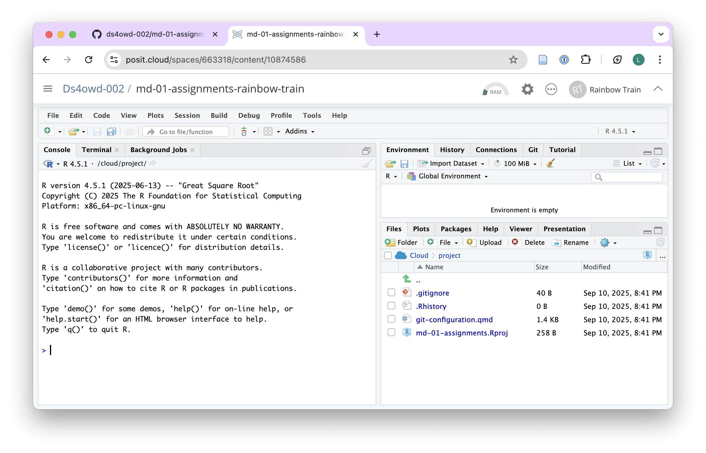
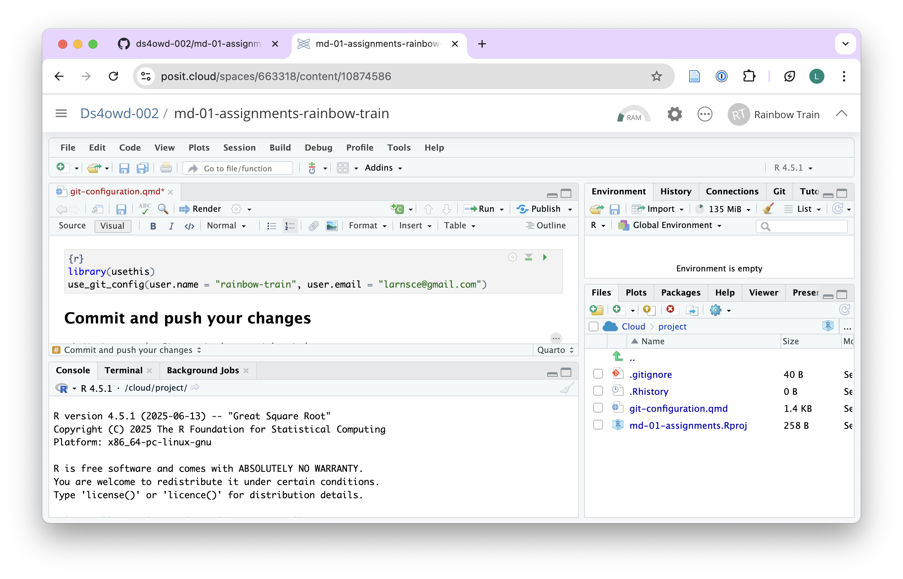
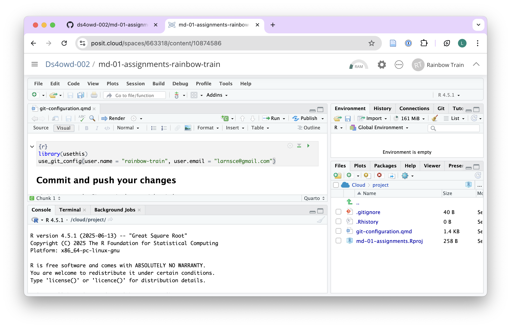
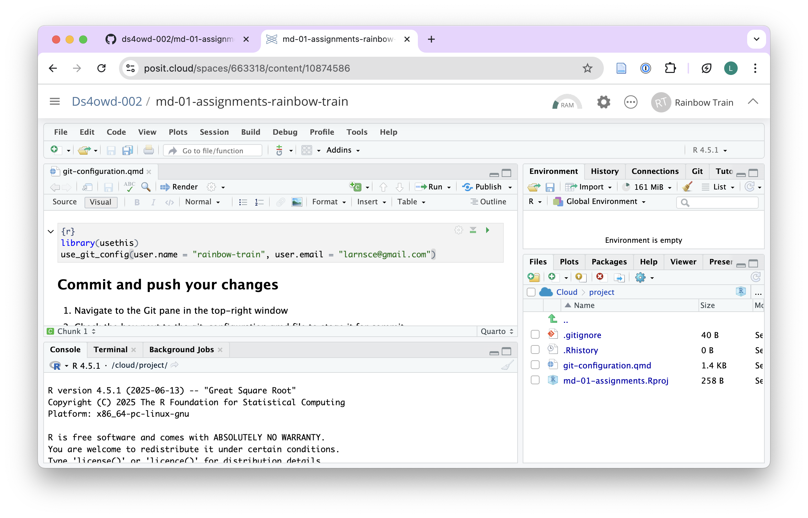

## Complete GitHub workflow

In this assignment, you will configure Git, commit changes, and create an issue on GitHub.

## Step 1: Introduce yourself to git

1. In Posit Cloud, open the md-01-assignments-USERNAME project that ends with your GitHub username.

{width=100%}

2. Open the **git-configuration.qmd** file from the bottom right window of RStudio by clicking on the file name in the Files pane. The file opens in the Source pane in the top-left window of RStudio.

{width=100%}

3. Under the heading [Git configuration]{.highlight-yellow} edit the code in the code chunk:

   - Replace the placeholder [Your Name]{.highlight-yellow} with your GitHub username
   - Replace [Your Email]{.highlight-yellow} with your email address  
   - Keep the quotes!
   
   These will be the details that git will use to identify you when you make changes to your work. 

{width=100%}

4. Save the file by clicking on the [Save]{.highlight-yellow} icon in the Source pane or by pressing `Ctrl + S` (Windows/Linux) or `Cmd + S` (Mac).

5. Render the document by clicking the [Render]{.highlight-yellow} button in the Source pane.

{width=100%}

6. Continue with the next step

## Step 2: Commit and push your changes

1. Navigate to the Git pane in the top-right window of RStudio

{width=100%}

2. Check the box next to the git-configuration.qmd file to stage it for commit

{width=100%}

3. Click on the "Commit" button. A new window opens.

{width=100%}

4. Enter a commit message in the "Commit message" field in the top right corner. For example: replaced placholders with my details

{width=100%}

5. Click on the "Commit" button

{width=100%}

6. If you see a message similar to the screenshot, you have successfully committed your changes to the local repository. Click on **Close**. If you do not see this message, make sure you have staged the file (checked the box next to it) for commit and entered a commit message.

{width=100%}

6. Click on the "Push" button in the top right corner.

{width=100%}

7. Enter your GitHub username and click OK

{width=100%}

8. Enter your GitHub Personal Access Token (PAT) in the field and click OK. This is the personal access token you created in [Assignment 1.3](am-01-3-github-pat.qmd). 

If you see a message similar to the screenshot below with `HEAD -> main`, then you have successfully pushed your changes to the remote repository on GitHub. Click Close. **If you do not see this message**, make sure you have entered your GitHub username and GitHub PAT correctly.

{width=100%}

warning call out: warn learner that if the have stored their PAT in a Word file, then a blank space might have been copied along with the PAT. Recommend to use a TXT file using Notepad or Mac TextEdit, or a password manager to store the PAT.

## Step 3: Open an issue on GitHub

1. Open <https://github.com/> in your browser.

{width=100%}

2. Navigate to the GitHub organisation for the course: 

{width=100%}

3. Find the repository `md-01-assignments-USERNAME` that [ends with your GitHub username]{.highlight-yellow}, and open it by clicking on the repository name.

- Replace `USERNAME` with your actual GitHub username.
- For example, if your username is `johnsmith`, the repository will be `md-01-assignments-johnsmith`.

::: {.callout-tip}
You can search for your repository by typing your username in the search bar just below the Repository heading. See "rainbow-train" in screenshot.
:::

{width=100%}

4. You can verify here that your changes have been pushed to the remote repository by looking at the text next to the `git-configuration.qmd` file. It should display the commit message you entered in the previous step, e.g., "replaced placeholders with my details". You can also verify by identifying the number of commits, here **2 commits**. Click on it and you can see them.

5. Click on the "Issues" tab.

{width=100%}

5. Click on the green "New issue" button.

{width=100%}

6. In the "Title" field write: "Completed module 1 assignment".

{width=100%}

7. In the "Leave a comment" field, tag the course instructors `@seawaR` `@massarin` `@larnsce`  and write a short message, e.g., "I have completed the module 1 assignment. Please review my work." You can also add any questions you have or other comments you would like to share with the instructors.

{width=100%}

8. Scroll down the page a bit and click the green **Create** button. 

{width=100%}

Congratulations! You have completed the GitHub workflow assignment.