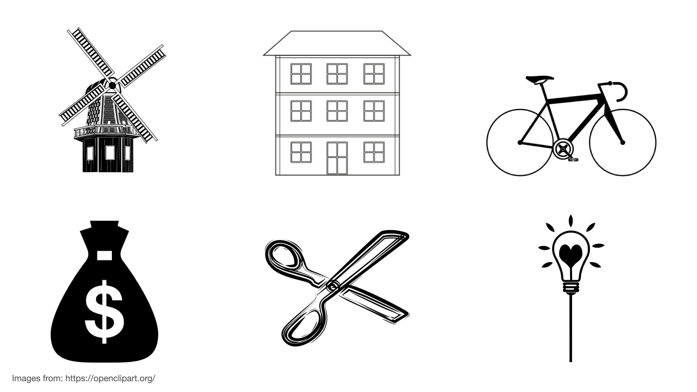
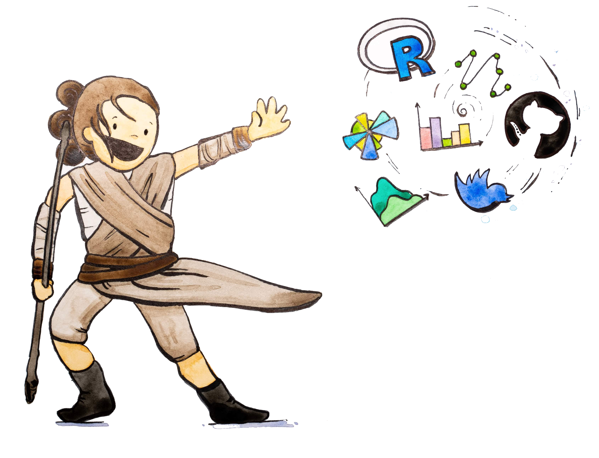

```{r}
#| label: setup
#| include: false

# Set global options
knitr::opts_chunk$set(
  echo = FALSE,
  warning = FALSE,
  message = FALSE
)

# Load required libraries
library(tidyverse)
library(robotoolbox)
library(readxl)
library(labelled)
library(countdown)
library(magrittr)

# Define OWD color palette
owd_palette <- c("#5b195b", "#9b2c60", "#ce525b",
                 "#f08453", "#ffbd54", "#f9f871")

background_color <- "#f5f5f2"
```

```{r}
#| label: load-data

form_id <- "ashaEDvw4ZLwGi9bqXGeqb"
form_file <- here::here("data", "registration_form.xlsx")

# fetch data from Kobo with robotoolbox
raw_data <- kobo_data(x = form_id,
                      all_versions = TRUE)

# read in questionnaire and labels from XLS form 
questionnaire <- read_xlsx(form_file,
                           sheet = "survey")

label_dict <- read_xlsx(form_file,
                        sheet = "choices")
```

```{r}
#| label: data-processing

registration_data <- raw_data |> 
  select(github_username,
         gender,
         age_group,
         country_residence,
         education,
         employment_situation,
         org_type,
         prog_general,
         prog_r,
         prog_python,
         starts_with("llm_platforms")) |> 
  distinct(github_username, .keep_all = TRUE)

# starts_with("llm_") & !starts_with("llm_platforms")
```

```{r}
# Total registrations
total_registrations <- nrow(registration_data)
```

## Email from GitHub? {.center-align .smaller}

While we are getting ready, please check for this email from GitHub and [accept the invitation]{.highlight-yellow} to join the GitHub organisation for the course. Used Gmail to sign up? Check the folders that aren't your primary inbox (e.g Updates).


# Welcome! {background-color="#4C326A"}

## Meet the team

::: columns
::: {.column width="33%"}
**Lars Schöbitz**

{fig-alt="Headshot of Lars Schöbitz" fig-align="left" width="150"}

-   Env. Engineer
-   retired WASH Researcher
-   [RStudio certified instructor](https://education.rstudio.com/trainers/)
:::

::: {.column width="33%"}
**Adriana Clavijo**

{fig-alt="Headshot of Adriana Clavijo" fig-align="left" width="150"}

-   Data Scientist
-   Spanish language support
-   Technical Support
:::

::: {.column width="33%"}
**Nicolò Massari**

{fig-alt="Headshot of Nicolò Massari" fig-align="left" width="150"}

-   Research Software Engineer
-   Computational Physicist
-   Technical Support
:::
:::


## Overall Goals (for the course)

1.  [Master data science tools]{.underline} - Use [(R, RStudio IDE, Git, GitHub, tidyverse, Quarto)]{.highlight-yellow} to analyze and communicate data effectively.

2.  [Create reproducible documents]{.underline} - Produce professional reports with [Quarto]{.highlight-yellow}, including citations, figures, and tables.

3.  [Practice open science]{.underline} - Share your [data and code openly]{.highlight-yellow}, following best practices for [reproducibility]{.highlight-yellow} and collaboration.

4.  [Build a portfolio]{.underline} - Complete real-world projects that [demonstrate your skills]{.highlight-yellow} to future employers or collaborators.

## Your turn: About you

::: task
Pick an item and take notes for 1 minute:

What does the item you have picked have to do with the reason for you being here?
:::



```{r}
#| echo: false

countdown(minutes = 1)
```

## In break-out rooms

::: task
**Take 1 minute each to share with your room partner:**

What does the item you have picked have to do with the reason for you being here?
:::


```{r}
#| echo: false

countdown(minutes = 5)
```

## Course Calendar {.smallest .scrollable}

```{r}
readr::read_csv(here::here("data", "tbl-01-ds4owd-002-course-schedule.csv")) |> 
  dplyr::select(date, week, topic = title, module) |> 
  dplyr::mutate(date = format(date, format = "%d %B %Y")) |> 
  knitr::kable()
```

## Course structure

-   [My turn]{.highlight-yellow}: Lecture segments + live coding
-   [Our turn]{.highlight-yellow}: Live coding + follow along
-   [Your turn]{.highlight-yellow}: Exercises in break-out rooms

## My turn: Lecture segments + live coding

-   Instructor writes and narrates code out loud
-   Instructor explains concepts and principles that are relevant
-   Learners [do not join]{.highlight-yellow}, but rather watch and listen
-   Learners are welcome to ask questions in the Zoom chat

## Our turn: Live coding + follow along

-   Instructor writes and narrates code out loud
-   Instructor explains concepts and principles that are relevant
-   Ideally, learners display their coding window on a [second screen]{.highlight-yellow}
-   Learners [join by writing and executing the same code]{.highlight-yellow}

## Your turn: Exercises in break-out rooms

-   Two to four learners work together in a break out session
-   One person (the driver) shares the screen and does the typing
-   The other persons (the navigator) offers comments and suggestions and write on their own

## Getting help

-   During [my turn]{.highlight-yellow} and [our turn]{.highlight-yellow} segments: Please keep your microphone on mute. Send a message to the [Zoom chat]{.highlight-yellow}, Adriana and Nicoló will support you

-   During [your turn]{.highlight-yellow} segments: Due to the large number of participants, it will not be feasible to join individual break-out rooms, but you will hopefully always be working in groups of 2 to 4 people.

## Platforms and Tools

-   R
-   tidyverse R Packages
-   Posit Cloud
-   RStudio IDE
-   Quarto publishing system
-   Element

## Course website {.center-align .large}

Bookmark this page in your browser

[]()

## Learning Objectives (for this week)

```{r}

lobj1 <- readr::read_csv(here::here("data/tbl-02-ds4owd-002-learning-objectives.csv")) |>
  dplyr::filter(week == params$week) |>
  dplyr::pull(learning_objectives)

```

::: incremental
1.  `r lobj1[1]`
2.  `r lobj1[2]`
3.  `r lobj1[3]`
4.  `r lobj1[4]`
:::

## 



::: aside
Artwork from [\@juliesquid](https://twitter.com/juliesquid) for [\@openscapes](https://twitter.com/openscapes) (illustrated by [\@allison_horst](https://twitter.com/allison_horst))
:::

# Posit Cloud {background-color="#4C326A"}

## - {background-image="img/lec-01/illustration-slides/illustration-slides.001.png"}

## - {background-image="img/lec-01/illustration-slides/illustration-slides.002.png"}

## - {background-image="img/lec-01/illustration-slides/illustration-slides.003.png"}

## - {background-image="img/lec-01/illustration-slides/illustration-slides.004.png"}

## - {background-image="img/lec-01/illustration-slides/illustration-slides.005.png"}

## - {background-image="img/lec-01/illustration-slides/illustration-slides.006.png"}

## - {background-image="img/lec-01/illustration-slides/illustration-slides.007.png"}

## Screen setup - Poll

::: columns
::: {.column width="50%"}
One computer screen 
:::

::: {.column width="50%"}
Two or more computer screens 
:::
:::

# Hello Quarto {background-color="#4C326A"}

## Meeting you where you are

::: columns
::: {.column width="50%"}
::: {.fragment .fade-in-then-semi-out}
I'll **assume** you

-   do [not]{.highlight-yellow} have R or git experience

-   have [not]{.highlight-yellow} worked in an IDE before (e.g. RStudio IDE)

-   want to [learn]{.highlight-yellow} about R

-   want to [learn]{.highlight-yellow} about Quarto and publishing

-   want to [learn]{.highlight-yellow} about project management with GitHub
:::
:::

::: {.column width="50%"}
::: {.fragment .fade-in}
I'll **teach** you

-   R

-   Quarto syntax and formats

-   Markdown

-   Git via RStudio GUI

-   GitHub issues, project management, and publishing
:::
:::
:::

# Learner profile {background-color="#4C326A"}

## Programming experience

`r total_registrations` registrations on pre-course survey.

```{r}
#| label: plot-programming-skills
#| fig-height: 6

# Get programming level labels and add line breaks
prog_labels <- label_dict |> 
  filter(list_name == "programming_exp") |> 
  select(name, label) |> 
  mutate(label = case_when(
    str_detect(label, "I have written a few") ~ "I have written\na few lines",
    str_detect(label, "I have written programs") ~ "I have written\nprograms for own use",
    str_detect(label, "I have written and maintained") ~ "I have written and\nmaintained larger software",
    TRUE ~ label
  ))

# Combine programming experience variables
prog_data <- registration_data |> 
  select(prog_general, prog_r, prog_python) |> 
  pivot_longer(everything(), 
               names_to = "skill_type", 
               values_to = "level") |> 
  left_join(prog_labels, by = c("level" = "name")) |> 
  mutate(level_label = coalesce(label, level),
         skill_type = case_when(
           skill_type == "prog_general" ~ "General",
           skill_type == "prog_r" ~ "R",
           skill_type == "prog_python" ~ "Python"
         ))

plot_programming <- prog_data |> 
  count(skill_type, level_label) |> 
  ggplot(aes(x = reorder(level_label, n), y = n, fill = skill_type)) +
  geom_col(position = "dodge") +
  geom_text(aes(label = n), position = position_dodge(width = 0.9), hjust = -0.2, size = 3, fontface = "bold") +
  coord_flip() +
  labs(x = "Experience Level", y = "Count", fill = "", title = "Programming experience") +
  theme_minimal() +
  theme(legend.position = "bottom",
        plot.background = element_rect(fill = background_color, color = NA),
        panel.background = element_rect(fill = background_color, color = NA)) +
  scale_fill_manual(values = owd_palette[1:3]) +
  scale_y_continuous(expand = expansion(mult = c(0, 0.15)))

print(plot_programming)
```


# What is Quarto? {background-color="#4C326A"}

## Quarto ...

-   is a new, open-source, scientific, and technical publishing system
-   aims to make the process of creating and collaborating dramatically better

{fig-alt="A schematic representing the multi-language input (e.g. Python, R, Observable, Julia) and multi-format output (e.g. PDF, html, Word documents, and more) versatility of Quarto." fig-align="center"}

## My turn: A tour of Quarto

<br><br>

::: {.hand-purple-large style="text-align: center;"}
Sit back and enjoy!
:::

## Your turn: Log into Posit Cloud with GitHub account {.smaller}

-   Go to the Posit Cloud Sign Up page: [login.posit.cloud/register](https://login.posit.cloud/register)
-   Click on the [Sign Up with GitHub]{.highlight-yellow} button.
-   Enter your GitHub username and password when prompted.
-   Open and accept the workspace invitation ([Link is in the Zoom chat now]{.highlight-yellow}).
-   Bookmark the address of the open tab in your browser.

::: callout-warning

# GitHub Authorisation
-   If this is your first time logging in to Posit Cloud with your GitHub account, you will be prompted to authorize Posit Cloud to access your GitHub account information.
-   Once you have authorized access, you will be redirected back to the Posit Cloud website and logged in to your account.
:::

::: speaker-notes
/
:::

```{r}
#| echo: false

countdown(minutes = 8)
```

## Take a break

[Please get up and move!]{.highlight-yellow} 

{width="25%"}

```{r}
countdown(minutes = 10)
```

::: aside
Photo by [Blake Wisz](https://unsplash.com/@blakewisz)
:::

## Your turn: md-01-exercises

::: task
1. Open [posit.cloud/spaces/663318/content](https://posit.cloud/spaces/663318/content) in your browser.
2. If you are not in the ds4owd-002 workspace, open it.
3. Click [Start]{.highlight-yellow} next to [md-01-exercises]{.highlight-yellow}.
4. In the File Manager in the bottom right window, locate the `hello-quarto.qmd` file and [click on it]{.highlight-yellow}.
5. Click the [Render button]{.highlight-yellow} to render the document. You may need to [allow pop-ups]{.highlight-yellow} in your browser.
6. In the YAML header, at the `author:` key replace `Your Name` with your name.
7. [Render]{.highlight-yellow} the document again.
8. Inspect components of the document and make one more update and re-render.
9. Discuss notes about updates you've made with your room partners. 
:::

```{r}
#| echo: false

countdown(minutes = 10)
```

## From the comfort of your own workspace

::: r-stack
{.fragment fig-alt="A screenshot of a Quarto document rendered inside RStudio" width="1200"}

{.fragment fig-alt="A screenshot of a Quarto document rendered inside JupyterLab" width="1200"}

{.fragment fig-alt="A screenshot of a Quarto document rendered inside VSCode" width="1200"}
:::

# Quarto formats {background-color="#4C326A"}

## One install, "Batteries included"

-   RMarkdown grew into a large ecosystem, with **varying syntax**.

. . .

-   Quarto comes **"batteries included"** straight out of the box

    -   HTML reports and websites
    -   PDF reports
    -   MS Office (Word, Powerpoint)
    -   Presentations (Powerpoint, Beamer, `revealjs`)
    -   Books

. . .

-   Any language, *exact* same approach and syntax

## Many Quarto formats {.smaller}

+-----------------+------------------------------------------------------------------------------------------------------+--------------------------------------------------------------------------------+
| Feature         | R Markdown                                                                                           | Quarto                                                                         |
+=================+======================================================================================================+================================================================================+
| Basic Formats   | [html_document](https://pkgs.rstudio.com/rmarkdown/reference/html_document.html)                     | [html](https://quarto.org/docs/output-formats/html-basics.html)                |
|                 |                                                                                                      |                                                                                |
|                 | [pdf_document](https://pkgs.rstudio.com/rmarkdown/reference/pdf_document.html)                       | [pdf](https://quarto.org/docs/output-formats/pdf-basics.html)                  |
|                 |                                                                                                      |                                                                                |
|                 | [word_document](https://pkgs.rstudio.com/rmarkdown/reference/word_document.html)                     | [docx](https://quarto.org/docs/output-formats/ms-word.html)                    |
+-----------------+------------------------------------------------------------------------------------------------------+--------------------------------------------------------------------------------+
| Beamer          | [beamer_presentation](https://pkgs.rstudio.com/rmarkdown/reference/beamer_presentation.html)         | [beamer](https://quarto.org/docs/presentations/beamer.html)                    |
+-----------------+------------------------------------------------------------------------------------------------------+--------------------------------------------------------------------------------+
| PowerPoint      | [powerpoint_presentation](https://pkgs.rstudio.com/rmarkdown/reference/powerpoint_presentation.html) | [pptx](https://quarto.org/docs/presentations/powerpoint.html)                  |
+-----------------+------------------------------------------------------------------------------------------------------+--------------------------------------------------------------------------------+
| HTML Slides     | [xaringan](https://bookdown.org/yihui/rmarkdown/xaringan.html)                                       | [revealjs](https://quarto.org/docs/presentations/revealjs/)                    |
|                 |                                                                                                      |                                                                                |
|                 | [ioslides](https://bookdown.org/yihui/rmarkdown/ioslides-presentation.html)                          |                                                                                |
|                 |                                                                                                      |                                                                                |
|                 | [revealjs](https://bookdown.org/yihui/rmarkdown/revealjs.html)                                       |                                                                                |
+-----------------+------------------------------------------------------------------------------------------------------+--------------------------------------------------------------------------------+
| Advanced Layout | [tufte](https://bookdown.org/yihui/rmarkdown/tufte-handouts.html)                                    | [Quarto Article Layout](https://quarto.org/docs/authoring/article-layout.html) |
|                 |                                                                                                      |                                                                                |
|                 | [distill](https://rstudio.github.io/distill/figures.html)                                            |                                                                                |
+-----------------+------------------------------------------------------------------------------------------------------+--------------------------------------------------------------------------------+

## Many Quarto formats {.smaller}

+------------------+------------------------------------------------------------------------------+-----------------------------------------------------------------------------+
| Feature          | R Markdown                                                                   | Quarto                                                                      |
+==================+==============================================================================+=============================================================================+
| Cross References | [html_document2](https://bookdown.org/yihui/bookdown/a-single-document.html) | [Quarto Crossrefs](https://quarto.org/docs/authoring/cross-references.html) |
|                  |                                                                              |                                                                             |
|                  | [pdf_document2](https://bookdown.org/yihui/bookdown/a-single-document.html)  |                                                                             |
|                  |                                                                              |                                                                             |
|                  | [word_document2](https://bookdown.org/yihui/bookdown/a-single-document.html) |                                                                             |
+------------------+------------------------------------------------------------------------------+-----------------------------------------------------------------------------+
| Websites & Blogs | [blogdown](https://pkgs.rstudio.com/blogdown/)                               | [Quarto Websites](https://quarto.org/docs/websites/)                        |
|                  |                                                                              |                                                                             |
|                  | [distill](https://pkgs.rstudio.com/distill/)                                 | [Quarto Blogs](https://quarto.org/docs/websites/website-blog.html)          |
+------------------+------------------------------------------------------------------------------+-----------------------------------------------------------------------------+
| Books            | [bookdown](https://pkgs.rstudio.com/bookdown/)                               | [Quarto Books](https://quarto.org/docs/books/)                              |
+------------------+------------------------------------------------------------------------------+-----------------------------------------------------------------------------+
| Interactivity    | [Shiny Documents](https://bookdown.org/yihui/rmarkdown/shiny-documents.html) | [Quarto Interactive Documents](https://quarto.org/docs/interactive/shiny/)  |
+------------------+------------------------------------------------------------------------------+-----------------------------------------------------------------------------+
| Journal Articles | [rticles](https://pkgs.rstudio.com/rticles/)                                 | [Journal Articles](https://quarto.org/docs/journals/)             |
+------------------+------------------------------------------------------------------------------+-----------------------------------------------------------------------------+
| Dashboards       | [flexdashboard](https://pkgs.rstudio.com/flexdashboard/)                     | [Quarto Dashboards](https://quarto.org/docs/dashboards/)          |
+------------------+------------------------------------------------------------------------------+-----------------------------------------------------------------------------+

## Your turn: Create a new Quarto document

::: task
In your [md-01-exercises]{.highlight-yellow} project on Posit Cloud, go to [File \> New File \> Quarto document]{.highlight-yellow} to create a Quarto document with HTML output. 

- [Render]{.highlight-yellow} the document, which will ask you to give it a name: you can use `my-first-document.qmd`.

Use the visual editor for the next steps.

-   Add a [title]{.highlight-yellow} and your name as the author.

-   Create four sections with headings of level 2 (Introduction, Methods, Results, Conclusions).

-   [**Stretch goal**]{.highlight-yellow}: Change the html theme to `sketchy`. Tipp: Check [quarto.org](https://quarto.org/) and use search function  with "HTML theming"
:::

```{r}
#| echo: false

countdown(minutes = 15)
```

# Version Control {background-color="#4C326A"}

## Version Control with Git and GitHub

A way to share files with others, so they can:

-   download
-   re-use
-   contribute

You can view the history of files, and jump back in time to any point.

## Why is it useful?

```{r echo=FALSE, fig.align = "center", out.width="40%"}

```

## Git and GitHub

::: columns
::: {.column width="50%"}
```{r echo=FALSE, out.width="25%"}
knitr::include_graphics("img/lec-01/git-logo.png")
```

-   Git is a software for version control
-   Created in 2005
-   Popular among programmers collaboratively developing code
-   Tracks changes in a set of files (directory/folder/repository)
:::

::: {.column width="50%"}
```{r echo=FALSE, out.width="25%"}
knitr::include_graphics("img/lec-01/github-logo.png")
```

-   GitHub is a hosting platform for version control using Git

-   Launched in 2008, aquired by Microsoft in 2018 for US\$ 7.5 billion

-   

    > 100 million Users (20.5 in 2022 alone) ([October, 2023](https://octoverse.github.com/2022/global-tech-talent))

-   Social media for software developers
:::
:::

## My turn: A tour of GitHub

::: {.hand-purple-large style="text-align: center;"}
Sit back and enjoy!
:::

## Your turn: Create an issue on GitHub {.smaller}

::: task

1. Open [github.com](https://github.com/) in your browser and login with your credentials
2. Exchange your GitHub username with your room partner by adding it into the Zoom chat.
3. Find and open the md-01-issue repository
4. Find the issue tracker ([Issues]{.highlight-yellow} tab) on the top menu bar
5. Click on [New issue]{.highlight-yellow} to create a new issue
6. Add the title "My first issue on GitHub" 
7. Add one of your room partners to the list of Assignees on the right panel by clicking on the gear icon and searching their username.
8. Add a comment to the issue and tag Adriana [@seawaR]{.highlight-yellow}, Nicoló [@massarin]{.highlight-yellow}, and Lars with [@larnsce]{.highlight-yellow}.
9. Click [Create]{.highlight-yellow} to add the new issue.
10. Check if you have received a notification about the new issue (Email or Notifications Inbox in the top-right corner on github.com).
11. Open the issue you are tagged in and respond to the comment of your room partner.
:::

```{r}
countdown(10)
```

## Take a break

[Please get up and move!]{.highlight-yellow} Let your emails rest in peace.

{width="25%"}

```{r}
countdown(minutes = 10)
```

::: aside
Photo by [Blake Wisz](https://unsplash.com/@blakewisz)
:::

# Anatomy of a Quarto document {background-color="#4C326A"}

## Components

1.  Metadata: YAML

2.  Text: Markdown

3.  Code: Executed via `knitr` or `jupyter`

. . .

**Weave it all together**, and you have beautiful, powerful, and useful outputs!

## Literate programming {.smaller}

Literate programming is writing out the program logic in a human language with included (separated by a primitive markup) code snippets and macros.

````         
---
title: "ggplot2 demo"
date: "5/23/2023"
format: html
---

## MPG

There is a relationship between city and highway mileage.

```{{r}}
#| label: fig-mpg

library(ggplot2)

ggplot(mpg, aes(x = cty, y = hwy)) + 
  geom_point() + 
  geom_smooth(method = "loess")
```
````

::: aside
Source: <https://en.wikipedia.org/wiki/Literate_programming>
:::

# Metadata {background-color="#4C326A"}

## YAML

"Yet Another Markup Language" or "YAML Ain't Markup Language" is used to provide document level metadata.

``` yaml
---
key: value
---
```

## Output options

``` yaml
---
format: something
---
```

. . .

<br>

``` yaml
---
format: html
---
```

``` yaml
---
format: pdf
---
```

``` yaml
---
format: revealjs
---
```

## Output option arguments

Indentation matters!

``` yaml
---
format: 
  html:
    toc: true
    code-fold: true
---
```

## YAML validation {.smaller}

-   Invalid: No space after `:`

``` yaml
---
format:html
---
```

-   Invalid: Read as missing

``` yaml
---
format:
html
---
```

## YAML validation {.smaller}

There are multiple ways of formatting valid YAML:

-   Valid: There's a space after `:`

``` yaml
format: html
```

-   Valid: `format: html` with selections made with proper indentation

``` yaml
format: 
  html:
    toc: true
```

# R fundamentals {background-color="#4C326A"}

## Packages {auto-animate="true"}

::: incremental
::: columns
::: {.column width="40%"}
**base R**

```{r}
#| eval: false
#| echo: true
sqrt(49)
sum(1, 2)
```

-   Functions come with R
:::

::: {.column width="5%"}
:::

::: {.column width="55%"}
**R Packages**

```{r}
#| eval: false
#| echo: true
library(dplyr)

```

-   Installed once in the Console: `install.packages("dplyr")`
-   Loaded per script
:::
:::
:::

::: notes
Packages

-   Main way that reusable code is shared in R
-   Combination of code, data, and documentation
-   R has a rich ecosystem of packages for data manipulation & analysis
:::

## Functions & Arguments {auto-animate="true"}

```{r}
#| code-line-numbers: "3-4"
#| eval: false
#| echo: true
library(dplyr)

filter(.data = gapminder, 
       year == 2007)
```

-   Function: `filter()`
-   Argument: `.data =`
-   Arguments following: `year == 2007` [What do do with the data]{.highlight-yellow}


## Functions & Arguments {auto-animate="true"}

```{r}
#| code-line-numbers: "3"
#| eval: false
#| echo: true
library(dplyr)

filter(gapminder, year == 2007)
```

-   Function: `filter()`
-   Argument: `.data =` [Does not need to be be spelled out]{.highlight-yellow}
-   Arguments following: `year == 2007` 

## Objects {auto-animate="true"}

```{r}
#| eval: false
#| code-line-numbers: "3-4"
#| echo: true
library(dplyr)

gapminder_yr_2007 <- filter(gapminder, year == 2007)
```

-   Function: `filter()`
-   Argument: `.data =`
-   Arguments following: `year == 2007` 
-   Assignment operator: `<-` [Assigns the result to an object]{.highlight-yellow} 
-   Object: `gapminder_yr_2007` [Name of the object that stores result]{.highlight-yellow}


## Operators {auto-animate="true"}

```{r}
#| eval: false
#| code-line-numbers: "3-4"
#| echo: true
library(dplyr)

gapminder_yr_2007 <- gapminder |> 
  filter(year == 2007) 
```

-   Function: `filter()`
-   Argument: `.data =`
-   Arguments following: `year == 2007`
-   Object: `gapminder_yr_2007`
-   Assignment operator: `<-`
-   Pipe operator: `|>` [Passes the result into the first argument of the next function]{.highlight-yellow}

## Rules

Rules of `dplyr` functions:

::: incremental
-   First argument is always a data frame
-   Subsequent arguments say what to do with that data frame
-   Always return a data frame\
-   Don't modify in place
:::

## Does this look and sound foreign and confusing?

::: {.callout-tip}
## These concepts will be repeated many times

We'll revisit these R fundamentals throughout the next 9 weeks:

- **Week by week**, we'll build on these concepts gradually
- **Practice will help** - you'll see these patterns repeatedly
- **No need to memorize** - understanding will come with practice

You're not expected to remember or fully understand everything right now. This is your first exposure!
:::

# Course information {background-color="#4C326A"}

## Weekly Structure

|          |                                           |
|----------|-------------------------------------------|
| **Monday**   |                             |
| **Tuesday**  | Office hours on Zoom (2 pm to 3 pm CET) |
| **Wednesday** | Homework due                           |
| **Thursday** | Module from 2 pm to 4:30 pm CET |
| **Friday**   |                                         |


## Homework assignments

-   Weekly assignments ([module 1 homework is required for participation]{.highlight-yellow})
-   Homework assignment due [Wednesdays before next module]{.highlight-yellow}
-   Quiz due [one week after homework assignment]{.highlight-yellow} and required for successful completion of the course
-   Submitted as rendered Quarto documents on GitHub
-   Reviewed by course instructors
-   Management and support through GitHub issue tracker

## Capstone Project

-   Data analysis project report with a dataset of your choice
-   Submitted as rendered Quarto document on GitHub
-   Submission [required for successful completion]{.highlight-yellow} of the course

# Homework assignments module 1 {background-color="#4C326A"}

## Module 1 documentation

::: learn-more
[content/modules/md-01.html](content/modules/md-01.html)

```{=html}
<iframe src="content/modules/md-01.html" width="100%" height="500" style="border:2px solid #123233;" title="Module 1 documentation"></iframe>
```
:::

## Homework due date

-   Homework assignment due: [Wednesday, ]{.highlight-yellow}
-   Quiz due: [Wednesday, ]{.highlight-yellow}

# Wrap-up {background-color="#4C326A"}

## Thanks!

Slides created via revealjs and Quarto: <https://quarto.org/docs/presentations/revealjs/>

Access slides as [PDF on GitHub](/website/raw/main/content/slides/lec-01-welcome.pdf)
