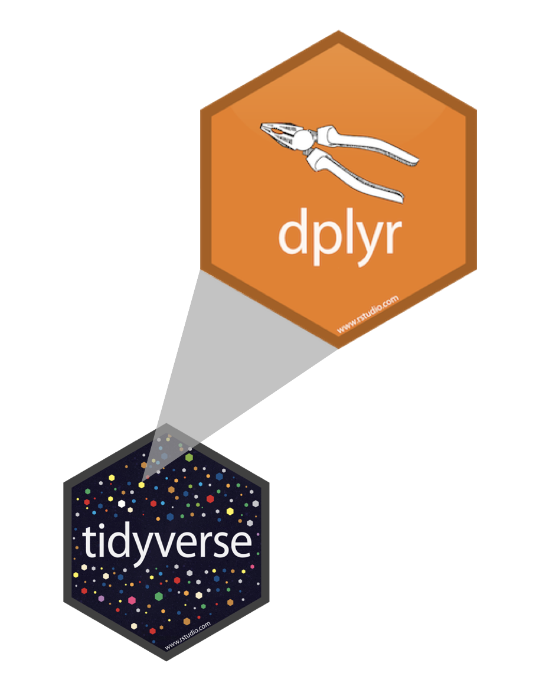

```{r}
#| include: false
library(countdown)
library(ggplot2)
library(readr)
library(dplyr)
library(gapminder)
library(epoxy)
library(ggthemes)
```

## Quiz Module 1

:::: {.columns}

::: {.column width="50%"}

### Due date extended!

- Original due date: ~~September 25th~~
- New due date: [October 2nd, 2025]{.highlight-yellow} (as for Quiz 2)
- Quiz completion rate currently at ~40%
- Extra week to complete the quiz

:::

::: {.column width="50%"}

### Submission verification

- We've created a table for you to verify your quiz submission
- Check if your submission has been recorded
- Link will be provided on course website after today's module
:::

::::

## Learning Objectives (for this week)

```{r}
#| label: learning-objectives

lobj <- readr::read_csv(here::here("data/tbl-02-ds4owd-002-learning-objectives.csv")) |> 
  dplyr::filter(week == params$week) |>
  dplyr::pull(learning_objectives)

```

```{epoxy}
{1:length(lobj)}. {lobj[1:length(lobj)]}
```


# Data wrangling with dplyr  {background-color="#4C326A"}

## A grammar of data wrangling... {.smaller}

... based on the concepts of functions as verbs that manipulate data frames

:::: {.columns}

::: {.column width="40%"}

```{r dplyr-part-of-tidyverse, echo=FALSE, out.width="70%", caption = "dplyr is part of the tidyverse"}

```

:::

::: {.column width="60%"}

- `select`: pick columns by name
- `arrange`: reorder rows
- `filter`: pick rows matching criteria
- `relocate`: changes the order of the columns
- `mutate`: add new variables
- `summarise`: reduce variables to values
- `group_by`: for grouped operations
- ... (many more)
:::

::::

::: {.aside}
Slide taken from [Data Science in a Box](https://datasciencebox.org/)
:::

# R fundamentals {background-color="#4C326A"}

## Packages {auto-animate="true"}

::: incremental
::: columns
::: {.column width="40%"}
**base R**

```{r}
#| eval: false
#| echo: true
sqrt(49)
sum(1, 2)
```

-   Functions come with R
:::

::: {.column width="5%"}
:::

::: {.column width="55%"}
**R Packages**

```{r}
#| eval: false
#| echo: true
library(dplyr)

```

-   Installed once in the Console: `install.packages("dplyr")`
-   Loaded per script
:::
:::
:::

::: notes
Packages

-   Main way that reusable code is shared in R
-   Combination of code, data, and documentation
-   R has a rich ecosystem of packages for data manipulation & analysis
:::

## Functions & Arguments {auto-animate="true"}

```{r}
#| code-line-numbers: "3-4"
#| eval: false
#| echo: true
library(dplyr)

filter(.data = gapminder, 
       year == 2007)
```

-   Function: `filter()`
-   Argument: `.data =`
-   Arguments following: `year == 2007` [What to do with the data]{.highlight-yellow}


## Functions & Arguments {auto-animate="true"}

```{r}
#| code-line-numbers: "3"
#| eval: false
#| echo: true
library(dplyr)

filter(gapminder, year == 2007)
```

-   Function: `filter()`
-   Argument: `.data =` [Does not need to be spelled out]{.highlight-yellow}
-   Arguments following: `year == 2007` 

## Objects {auto-animate="true"}

```{r}
#| eval: false
#| code-line-numbers: "3-4"
#| echo: true
library(dplyr)

gapminder_2007 <- filter(gapminder, year == 2007)
```

-   Function: `filter()`
-   Argument: `.data =`
-   Arguments following: `year == 2007` 
-   Assignment operator: `<-` [Assigns the result to an object]{.highlight-yellow} 
-   Object: `gapminder_2007` [Name of the object that stores result]{.highlight-yellow}


## Operators {auto-animate="true"}

```{r}
#| eval: false
#| code-line-numbers: "3-4"
#| echo: true
library(dplyr)

gapminder_2007 <- gapminder |> 
  filter(year == 2007) 
```

-   Function: `filter()`
-   Argument: `.data =`
-   Arguments following: `year == 2007`
-   Object: `gapminder_2007`
-   Assignment operator: `<-`
-   Pipe operator: `|>` [Passes the result into the first argument of the next function]{.highlight-yellow}

## Rules

Rules of `dplyr` functions:

::: incremental
-   First argument is always a data frame
-   Subsequent arguments say what to do with that data frame
-   Always return a data frame\
-   Don't modify in place
:::

## Plot {auto-animate="true" .smaller}

```{r}
#| eval: true
#| code-line-numbers: "3-4,6"
#| echo: true
#| fig.width: 4
#| fig.asp: 0.618

library(dplyr)

gapminder_2007 <- gapminder |> 
  filter(year == 2007) 
  
ggplot(data = gapminder_2007,
       mapping = aes(x = continent,
                     y = lifeExp,
                     fill = continent)) +
  geom_boxplot(outlier.shape = NA) 
```

# Our turn: SDG 6.2.1 {background-color="#4C326A"}

## Data {.smallest}

```{r}

sanitation <- read_csv("https://raw.githubusercontent.com/ds4owd-dev/md-03-exercises/master/data/jmp_wld_sanitation_long.csv")

```

```{r}
#| echo: true
#| eval: false

head(sanitation)
```

<br>

```{r}
#| echo: false

head(sanitation) |> 
  knitr::kable(digits = 1)
```

<br>

. . .

```{r}
#| echo: true
ncol(sanitation)
```

<br>

. . .

```{r}
#| echo: true
nrow(sanitation)
```

## Data {.smaller}

```{r}
#| echo: true
#| eval: false
sanitation |> 
  count(varname_short, varname_long)
```


```{r}
#| echo: false
#| eval: true
sanitation |> 
  count(varname_short, varname_long) |> 
  knitr::kable()
```

## Our turn: md-03-exercises

::: task
1. Open [posit.cloud/spaces/663318/content](https://posit.cloud/spaces/663318/content) in your browser.
2. Verify that the [ds4owd workspace]{.highlight-yellow} is open.
3. Click [Start]{.highlight-yellow} next to [md-03-exercises]{.highlight-yellow}.
4. In the File Manager in the bottom right window, locate the [`01-dplyr-our-turn.qmd`]{.highlight-yellow} file and click on it to open it in the top left window.
:::
```{r}
countdown(15)
```

## Take a break

[Please get up and move!]{.highlight-yellow} 

{width="50%"}

```{r}
countdown(minutes = 10)
```

::: footer
Image generated with [DALL-E 3 by OpenAI](https://openai.com/blog/dall-e/)
:::

## Your turn: md-03-exercises

::: task
1. Open [posit.cloud/spaces/663318/content](https://posit.cloud/spaces/663318/content) in your browser.
2. Verify that the [ds4owd workspace]{.highlight-yellow} is open.
3. Click [Start]{.highlight-yellow} next to [md-03-exercises]{.highlight-yellow}.
4. In the File Manager in the bottom right window, locate the [`02-dplyr-your-turn.qmd`]{.highlight-yellow} file and click on it to open it in the top left window.
:::
```{r}
countdown(25)
```

## R Terminology

```{r}
#| eval: false
#| echo: true
library(dplyr)

sanitation_national_2020_sm <- sanitation |> 
  filter(residence == "national",
         year == 2020,
         varname_short == "san_sm")
```

-   Function: `filter()`
-   Arguments following: `residence == "national", etc.` [What to do with the data]{.highlight-yellow}
-   Data (Object): `sanitation_national_2020_sm`
-   Assignment operator: `<-`
-   Pipe operator: `|>`


## Task 1.2

1.  Use the `filter()` function to create a subset from the `sanitation` data containing urban and rural estimates for Nigeria.
2.  Store the result as a new object in your environment with the name `sanitation_nigeria_urban_rural`

```{r}
#| echo: true
sanitation_nigeria_urban_rural <- sanitation |> 
  filter(name == "Nigeria", residence != "national")
```

## Task 1.3 - Connected scatterplot {}

 Great for timeseries data 

::: small

1.  Use the `ggplot()` function to create a connected scatterplot with `geom_point()` and `geom_line()` for the data you created in Task 1.2.

2.  Use the `aes()` function to map the year variable to the x-axis, the `percent` variable to the y-axis, and the `varname_short` variable to color and group aesthetic.

3.  Use `facet_wrap()` to create a separate plot for urban and rural populations.

4.  Change the colors using `scale_color_colorblind()`.

:::

```{r}
#| fig.width: 7
#| fig.asp: 0.618
#| out-width: 100%
#| output-location: slide
#| echo: true
ggplot(data = sanitation_nigeria_urban_rural,
       mapping = aes(x = year, 
                     y = percent, 
                     group = varname_short, 
                     color = varname_short)) +
  geom_point() +
  geom_line() +
  facet_wrap(~residence) +
  scale_color_colorblind() 
```

## Our turn: back to 01-dplyr-our-turn.qmd

::: task
1. Open [posit.cloud/spaces/663318/content](https://posit.cloud/spaces/663318/content) in your browser.
2. Verify that the [ds4owd workspace]{.highlight-yellow} is open.
3. Click [Start]{.highlight-yellow} next to [md-03-exercises]{.highlight-yellow}.
4. In the File Manager in the bottom right window, locate the [`01-dplyr-our-turn.qmd`]{.highlight-yellow} file and click on it to open it in the top left window.
:::
```{r}
countdown(30)
```

## Take a break

[Please get up and move!]{.highlight-yellow} 

{width="50%"}

```{r}
countdown(minutes = 5)
```

::: footer
Image generated with [DALL-E 3 by OpenAI](https://openai.com/blog/dall-e/)
:::

## Your turn: md-03-exercises

::: task
1. Open [posit.cloud/spaces/663318/content](https://posit.cloud/spaces/663318/content) in your browser.
2. Verify that the [ds4owd workspace]{.highlight-yellow} is open.
3. Click [Start]{.highlight-yellow} next to [md-03-exercises]{.highlight-yellow}.
4. In the File Manager in the bottom right window, locate the [`03-dplyr-your-turn.qmd`]{.highlight-yellow} file and click on it to open it in the top left window.
:::
```{r}
countdown(20)
```

# Homework assignments module 3 {background-color="#4C326A"}

## Module 3 documentation

::: learn-more
[{{< var course.site-short >../modules/md-03.html]({{< var course.site >../modules/md-03.html)

```{=html}
<iframe src="{{< var course.site >../modules/md-03.html" width="100%" height="500" style="border:2px solid #123233;" title="Module 3 documentation"></iframe>
```
:::

## Homework due date

-   Homework assignment due: [Monday, September 29th 2025]{.highlight-yellow}
-   Quiz due: [Tuesday, October 8th 2025]{.highlight-yellow} 

# Wrap-up {background-color="#4C326A"}

## Thanks! `r emo::ji("sunflower")`

Slides created via revealjs and Quarto: <https://quarto.org/docs/presentations/revealjs/>

Access slides as [PDF on GitHub](/website/raw/ma../../slides/lec-03-transformation.pdf)
