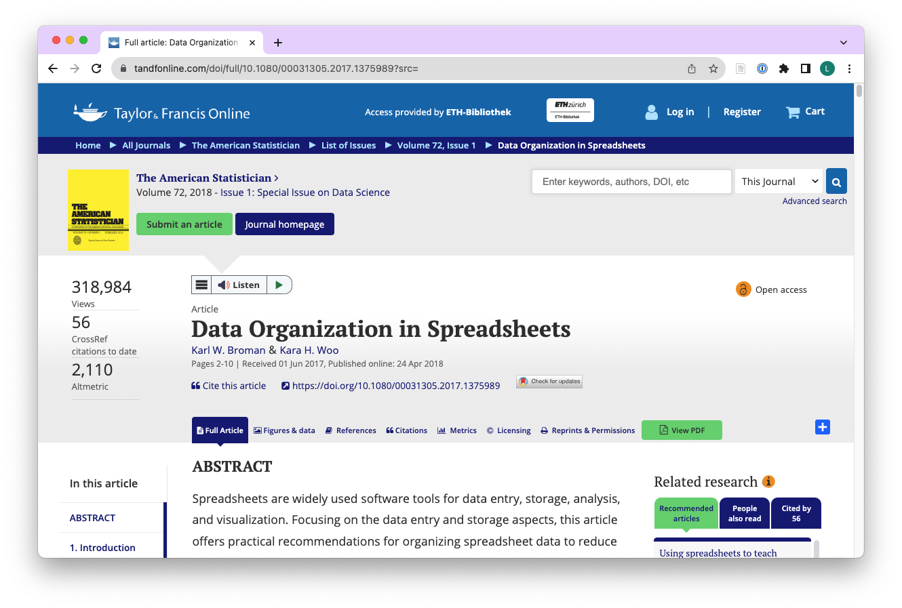

```{r}
#| include: false
library(countdown)
library(ggplot2)
library(readr)
library(dplyr)
library(gapminder)
library(epoxy)
library(ggthemes)
library(gt)
library(tidyr)
library(stringr)
library(readxl)
library(palmerpenguins)
library(lubridate)
```

```{r}
#| echo: false
sludge <- read_excel(here::here("content/slides/data/raw/faecal-sludge-analysis.xlsx")) |> 
  mutate(date_sample = as_date(date_sample)) |> 
  rename(date = date_sample)
```

## Learning Objectives (for this week)

```{r}
#| label: learning-objectives
#| echo: false
lobj <- readr::read_csv(here::here("data/tbl-02-ds4owd-002-learning-objectives.csv")) |> 
  dplyr::filter(week == params$week) |>
  dplyr::pull(learning_objectives)

```

```{epoxy}
{1:length(lobj)}. {lobj[1:length(lobj)]}
```

# Looking back: Module 4 {background-color="#4C326A"}

## Data Organization in Spreadsheets

```{r}

```

::: footer
[Screenshot taken on 2025-10-02](https://www.tandfonline.com/doi/full/10.1080/00031305.2017.1375989?src=)
:::

## Rules for variable names

-   avoid spaces
-   avoid special characters
-   use consistent naming conventions (e.g. snake_case)

. . .

::: columns
::: {.column width="20%"}
**use**

-   ts
-   users
-   system
:::

::: {.column width="80%"}
**avoid**

-   Total Solids (g/L)
-   Number of users
-   System (pit latrine / septic tank)
:::
:::

## Data dictionary / codebook

-   variable descriptions belong into a data dictionary / codebook (not into variable names)
-   data dictionaries / codebooks are separate files

. . . 

| variable_name | description                                                             |
|---------------|-------------------------------------------------------------------------|
| ts            | Total solids in g/L.                                                    |
| users         | Number of users per system.                                             |
| system        | Sanitation system in use at sample location (septic tank / pit latrine). |

# Conditional statements {background-color="#4C326A"}

## dplyr functions `mutate()` & `case_when()`

-   `mutate()` adds new variables to a data frame
-   `case_when()` is another form of an if-else statement
-   combination of functions are used to create variables with new values or fix existing ones

## My turn: Conditional statements

<br><br>

::: {.hand-purple-large style="text-align: center;"}
Sit back and enjoy!
:::

```{r}
countdown(20)
```

## Take a break

[Please get up and move!]{.highlight-yellow} 

{width="50%" fig-alt="A pixel art style image of a serene beach scene. The beach is lined with tall, lush palm trees swaying gently in the breeze. The sand is golden and pristine, meeting the clear blue waters of the ocean. The sky is a gradient of soft blues, with a few fluffy white clouds drifting lazily. The sun is setting in the background, casting warm orange and pink hues across the sky and sea, creating a tranquil and picturesque setting."}

```{r}
countdown(minutes = 10)
```

::: footer
Image generated with [DALL-E 3 by OpenAI](https://openai.com/blog/dall-e/)
:::

## Your turn: md-05-exercises

::: task
1. Open [posit.cloud/spaces/663318/content](https://posit.cloud/spaces/663318/content) in your browser.
2. Verify that the [ds4owd workspace]{.highlight-yellow} is open.
3. Click [Start]{.highlight-yellow} next to [md-05-exercises]{.highlight-yellow}.
4. In the File Manager in the bottom right window, locate the [`md-05a-conditions-your-turn.qmd`]{.highlight-yellow} file and click on it to open it in the top left window.
:::

```{r}
countdown(20)
```

## Task 1 {.scrollable}

1.  A mistake happened during data entry for sample id 16. Use `mutate()` and `case_when()` to change the ts value of 0.72 to 8.72.

```{r}
#| echo: true
#| eval: false
sludge |> 
    mutate(ts = case_when(
        ts ==  0.72 ~ 8.72,
        .default = ts
    ))
```

```{r}
#| echo: false
#| eval: true
sludge |> 
    mutate(ts = case_when(
        ts ==  0.72 ~ 8.72,
        .default = ts
    )) |> 
  gt()
```

## Task 2

1.  Another mistake happened during data entry for sample id 6. Use `mutate()` and `case_when()` to change the system value of id 6 from "pit latrine" to "septic tank".

```{r}
#| echo: true
#| eval: false
sludge |> 
    mutate(system = case_when(
        id ==  6 ~ "septic tank",
        .default = system
    ))

```

```{r}
#| echo: false
#| eval: true
sludge |> 
    mutate(system = case_when(
        id ==  6 ~ "septic tank",
        .default = system
    )) |> 
  gt()

```

## Task 3 (stretch goal)

1.  Add a new variable with the name `ts_cat` to the dataframe. that categorises sludge samples into low, medium and high solids content.Use `mutate()` and `case_when()` to create the new variable.

-   samples with less than 15 g/L are categorised as low
-   samples with 15 g/L to 50 g/L are categorised as medium
-   samples with more than 50 g/L are categorised as high

## Task 3 (stretch goal)

```{r}
#| echo: true
#| eval: false
sludge |> 
    mutate(ts_cat = case_when(
        ts < 15 ~ "low",
        ts >= 15 & ts <= 50 ~ "medium",
        ts > 50 ~ "high"
    ))
```

```{r}
#| echo: false
#| eval: true
sludge |> 
    mutate(ts_cat = case_when(
        ts < 15 ~ "low",
        ts >= 15 & ts <= 50 ~ "medium",
        ts > 50 ~ "high"
    )) |> 
  gt()
```

## Task 3 (stretch goal)

```{r}
#| echo: true
#| eval: false
sludge |> 
    mutate(ts_cat = case_when(
        ts < 15 ~ "low",
        ts >= 15 & ts <= 50 ~ "medium",
        ts > 50 ~ "high"
    )) |> 
  count(ts_cat)
```

```{r}
#| echo: false
#| eval: true
sludge |> 
    mutate(ts_cat = case_when(
        ts < 15 ~ "low",
        ts >= 15 & ts <= 50 ~ "medium",
        ts > 50 ~ "high"
    )) |> 
    count(ts_cat) |> 
  gt()
```

# Dates and times {background-color="#4C326A"}

## Dates and times in R

-   Dates and times are stored as numbers in R
-   Dates are stored as the number of days since 1970-01-01
-   Times are stored as the number of seconds since 1970-01-01 00:00:00
-   Dates and times are stored as numeric values, but can be formatted to look like dates and times

## My turn: Dates

<br><br>

::: {.hand-purple-large style="text-align: center;"}
Sit back and enjoy!
:::

```{r}
countdown(15)
```

## Take a break

[Please get up and move!]{.highlight-yellow} Let your emails rest in peace.

{width="50%" fig-alt="A pixel art style image of a serene beach scene. The beach is lined with tall, lush palm trees swaying gently in the breeze. The sand is golden and pristine, meeting the clear blue waters of the ocean. The sky is a gradient of soft blues, with a few fluffy white clouds drifting lazily. The sun is setting in the background, casting warm orange and pink hues across the sky and sea, creating a tranquil and picturesque setting."}

```{r}
countdown(minutes = 10)
```

::: footer
Image generated with [DALL-E 3 by OpenAI](https://openai.com/blog/dall-e/)
:::

# Tables display {background-color="#4C326A"}

## R packages for displaying tables

-   Many packages for displaying tables in R
-   `gt` package is one of the most popular and flexible
-   `kable()` function of `knitr` package useful for simple tables

## Our turn: md-05-exercises

::: task
1. Open [posit.cloud/spaces/663318/content](https://posit.cloud/spaces/663318/content) in your browser.
2. Verify that the [ds4owd workspace]{.highlight-yellow} is open.
3. Click [Start]{.highlight-yellow} next to [md-05-exercises]{.highlight-yellow}.
4. In the File Manager in the bottom right window, locate the [`md-05c-tables.qmd`]{.highlight-yellow} file and click on it to open it in the top left window.
:::

```{r}
countdown(30)
```

# Cross references {background-color="#4C326A"}

## Cross references

-   Help readers to navigate your document with numbered references and hyperlinks to entities like figures and tables.

-   Cross referencing steps:

    -   Add a caption to your figure or table.
    -   Give an ID to your figure or table, starting with `fig-` or `tbl-`.
    -   Refer to it with `@fig-...` or `@tbl-...`.

## Table cross references {.smaller}

The presence of the caption (`A few penguins`) and label (`#tbl-penguins`) make this table referenceable:

See `@tbl-penguins` for data on a few penguins.

becomes:

See @tbl-penguins for data on a few penguins.

```{r}
#| echo: fenced
#| label: tbl-penguins
#| tbl-cap: A few penguins

head(penguins) |> 
  gt()
```


# Homework assignments module 5 {background-color="#4C326A"}

## Module 5 documentation

::: learn-more
[content/modules/md-05.html](content/modules/md-05.html)

```{=html}
<iframe src="content/modules/md-05.html" width="100%" height="500" style="border:2px solid #123233;" title="Module 5 documentation"></iframe>
```
:::

## Dataset for capstone project

- In Module 4, you completed an assignment to identify and assess a dataset for your capstone project
- You documented your data assessment in `data-assessment.qmd`
- You opened an issue on GitHub to share your dataset selection with us

## Dataset selection is a pre-condition

::: {.callout-important}
## Important: Dataset must be selected before Module 5 homework

If you haven't yet selected a dataset, please complete the Module 4 Assignment 1 now:

[content/assignments/md-04/am-04-1-data.html](content/assignments/md-04/am-04-1-data.html)

This is required before you can complete the Module 5 homework, where you will upload your data to your GitHub repository.
:::

## Questions about your data?

- Use the GitHub issue tracker in your `md-04-assignments-USERNAME` repository
- Tag the instructors: `@seawaR` `@massarin` `@larnsce`
- We can help you with:
  - Privacy and data sharing concerns
  - Identifying alternative datasets
  - Determining what modifications are needed
  - Aggregation strategies for sensitive data

## Homework due date

-   Homework assignment due: [Monday, October 20th 2025]{.highlight-yellow}

# Wrap-up {background-color="#4C326A"}

## Thanks!

Slides created via revealjs and Quarto: <https://quarto.org/docs/presentations/revealjs/>

Access slides as [PDF on GitHub](/website/raw/main/content/slides/lec-05-conditions.pdf)

## References
