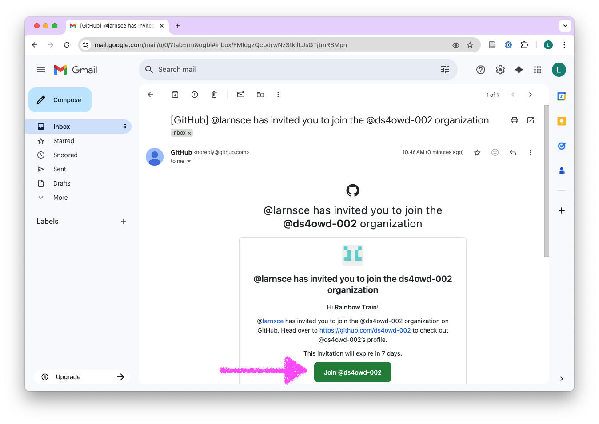

```{r}
#| include: false
library(countdown)
library(magrittr)
```

## Email from GitHub? {.center-align}

While we are getting ready, please check for this email from GitHub and [accept the invitation]{.highlight-yellow} to join the GitHub organisation for the course. Used Gmail to sign up? Check the folders that aren't your primary inbox (e.g Updates).



# Welcome! `r emo::ji("wave")` {background-color="#4C326A"}

## Meet the team

::: columns
::: {.column width="50%"}
**Lars Schöbitz**

{fig-alt="Headshot of Lars Schöbitz" fig-align="center"}

-   Env. Engineer
- retired WASH Researcher
-   [RStudio certified instructor](https://education.rstudio.com/trainers/)
:::

::: {.column width="50%"}
**Adriana Clavijo**

{fig-alt="Headshot of Adriana Clavijo" fig-align="center"}

-   Data Scientist
-   Spanish language support
:::
:::


## Learning Goals (for the course)

1.  **Master data science tools** - Use [(R, RStudio IDE, Git, GitHub, tidyverse, Quarto)]{.highlight-yellow} to analyze and communicate data effectively.

2.  **Create reproducible documents** - Produce professional reports with [Quarto]{.highlight-yellow}, including citations, figures, and tables.

3.  **Practice open science** - Share your data and code openly, following best practices for reproducibility and collaboration.

4.  **Build a portfolio** - Complete real-world projects that demonstrate your skills to future employers or collaborators.


## Course Calendar {.smallest .scrollable}

```{r}
readr::read_csv("../data/tbl-01-ds4owd-002-course-schedule.csv") |> 
  dplyr::select(date, week, topic = title, module) |> 
  dplyr::mutate(date = format(date, format = "%d %B %Y")) |> 
  knitr::kable()
```

# Course information {background-color="#4C326A"}

## Weekly Structure

|               |                                            |
|---------------|--------------------------------------------| 
| **Monday**    |                                            |
| **Tuesday**   | Office hours on Zoom from 2 pm to 3 pm CET |
| **Wednesday** |                                            |
| **Thursday**  | Module on Zoom from 2 pm to 4:30 CET       |
| **Friday**    |                                            |


## Weekly Quiz

- Identify students' understanding of the material covered in the previous week
- Expected to be completed within two weeks after the lecture
- Identifies if students participated in live lecture or watched the recording
- [Successful completion of the course will require students to complete all quizzes]{.highlight-peach}

## Homework assignments

-   Weekly assignments
-   Submitted as rendered Quarto documents on GitHub
-   Reviewed by course instructors for errors and feedback
-   Management and support through GitHub issue tracker

## Capstone Project

-   Data analysis project report with a dataset of your choice
-   Submitted as rendered Quarto document on GitHub
-   Report will be a public website (see [examples from ds4owd-001](https://openwashdata.org/pages/academy/graduates/))
-   Submission [required for successful completion]{.highlight-yellow} of the course

## openwashdata R data packages

-  Publish all datasets from participants as open data, following openwashdata workflows
-  Data package will be a public website
-  We will support the data curation and publication process

## Mentorship program

-  We are planning to create mentorship study groups for participants
-  The number of potential mentors is limited
-  We will match people with more experience with those who are complete novices
-  The mentorship program will be optional and starts after the Module 2 or Module 3

# What's next?

## Zoom Registration

- You will receive an email with a registration link for the Zoom meetings for each module
- Please register for the Zoom meetings
- Hold onto the confirmation email, as it contains the link to the Zoom meeting
- Ensure that you have a Zoom account, so that you can join the meetings

## Module 1

-  [Module 1](../modules/md-01.qmd) starts on **Thursday, 11th September 2025**

# Wrap-up {background-color="#4C326A"}

## Thanks! `r emo::ji("sunflower")` 

Slides created via revealjs and Quarto: https://quarto.org/docs/presentations/revealjs/ Access slides as [PDF on GitHub](/website/raw/main/slides/lec-00-qa-session.pdf)

All material is licensed under [Creative Commons Attribution Share Alike 4.0 International](https://creativecommons.org/licenses/by-sa/4.0/).


